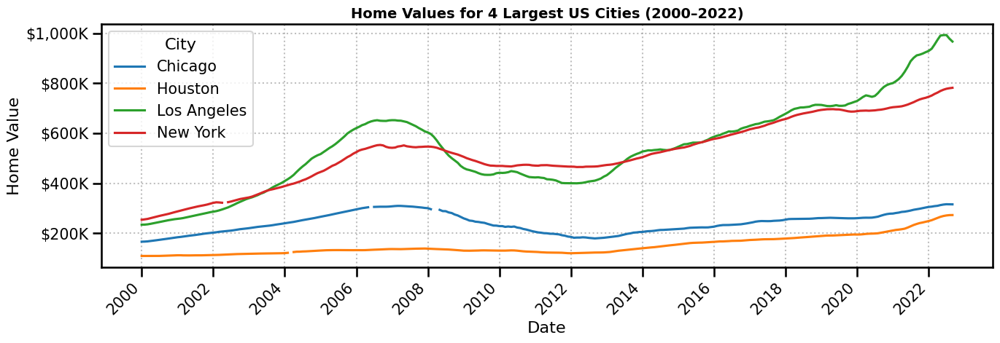

# Zillow Home Value Analysis — Time Series

## Overview

This project analyzes typical home values across the 4 largest U.S. cities
(New York, Los Angeles, Houston, and Chicago) using Zillow's Home Value Index (ZHVI).
The analysis covers 22 years of monthly data from January 2000 to September 2022,
spanning the housing bubble, the 2008 financial crisis, the recovery, and the
post-COVID acceleration.

---

## Business Questions

1. How have home values trended across the 4 largest U.S. cities from 2000 to 2022?
2. Which city had the highest and lowest typical home value at the end of 2008?
3. How much did home values change month-over-month during the peak of the crisis
   (November to December 2008)?

---

## Dataset

- **Source:** Zillow Research — Home Value Index (ZHVI)
- **Format:** Wide-form CSV (one row per city, one column per month)
- **Size:** 22,467 cities x 281 columns (8 metadata + 273 monthly timestamps)
- **Cities analyzed:** New York, Los Angeles, Houston, Chicago (SizeRank 0 to 3)

---

## Key Findings

### Q1 — Home Values at End of 2008

| City | Home Value | Note |
|------|------------|------|
| New York | $510,309 | Highest |
| Los Angeles | $469,294 | |
| Chicago | $265,306 | |
| Houston | $131,283 | Lowest |

### Q2 — Month-over-Month Change: Nov to Dec 2008

| City | Change | Note |
|------|--------|------|
| Los Angeles | -$12,611 | Largest drop |
| Chicago | -$5,753 | |
| New York | -$4,458 | |
| Houston | -$964 | Smallest drop |

---

## Visualization



This plot shows monthly typical home values for all 4 cities from 2000 to 2022.
Three distinct phases are visible:

**2000 to 2006 — The Housing Boom:**
Los Angeles and New York surged aggressively. LA nearly tripled from ~$230K to ~$650K.
Chicago grew moderately. Houston remained flat, reflecting that the bubble was
concentrated in high-demand coastal markets.

**2006 to 2012 — The Crash and Aftermath:**
LA dropped the hardest, losing roughly $200K in value. New York declined more gradually.
Chicago fell steadily through 2012. Houston barely moved, insulated by its lower price
point and oil-driven local economy.

**2012 to 2022 — Recovery and Acceleration:**
All four cities recovered and surpassed pre-crisis peaks. The post-COVID period produced
the steepest single acceleration on record. LA crossed $1M and New York approached $800K
by late 2022.

---

## Methodology

| Step | Description |
|------|-------------|
| Filter | Kept only cities with SizeRank < 4 |
| Reshape | Converted wide-form to long-form using pd.melt() |
| Index | Set Date as datetime index, resampled to monthly frequency |
| MultiIndex | Grouped by city using groupby + resample |
| Unstack | Pivoted RegionName into columns for plotting |
| Analysis | Used .loc[] for snapshots and .diff() for month-over-month changes |

---

## Tech Stack

- Python 3
- pandas
- matplotlib
- seaborn
- numpy

---

## File Structure

```plaintext
zillow-home-value-analysis-time-series/
├── zillow_home_values_analysis.ipynb
├── home_values_4_cities_2000_2022.png
└── README.md
```
---

## How to Run

1. Clone the repo
2. Install dependencies: `pip install pandas matplotlib seaborn numpy`
3. Open `zillow_home_values_analysis.ipynb` in Jupyter or Google Colab
4. Run all cells — data loads directly from the public Google Sheets URL, no download needed

---

*Data: Zillow Home Value Index (ZHVI) | Analysis period: Jan 2000 to Sep 2022*
---

**Author:** Ali Abu Sohiban
